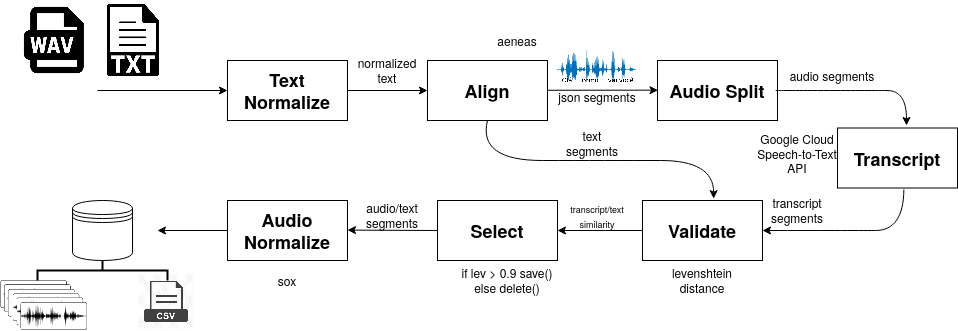

# KABooks - KABooks Audiobook dataset creator
KABooks is an auxiliary tool in the creation of audio datasets, for training Text-to-Speech and Speech-to-Text models, based on the work of Pansori [https://arxiv.org/abs/1812.09798]. 

From a list of audio and text files, KABooks will segments all the audios, performing audio-text alignment using the AENEAS tool. Using another transcription tool, the data are validated and discarded if there is no minimum guarantee of correspondence between the audio and the text.

Use at your own risk.



## Normalize Text

The subtitles contain segmented text and timing information which corresponds to the audio contents of the associated video. THe timing subtitles is discarded and subtitles are joined. The text corresponding to the sentences is normalized and divided into sentences, according to the punctuation, if any, or the minimum and maximum number of words previously defined.

## Align Text-Audio

The audio is divided into segments according to the text, according to the timming obtained from AENEAS.

## Validate

Although the audio and subtitle data are force-aligned with each other, there are also inherent discrepancies between the two. This can come from one or more of the following: inaccurate transcriptions, ambiguous pronunciations, and non-ideal audio conditions (like ambient noise or poor recording quality). To increase the quality of the corpus, the corpus needs to be refined by filtering out inaccurate audio and subtitle pairs.

At KABooks, we use an ASR to transcribe the audio files and compare with the aligned subtitles; and then we compared the caption with the transcript using the levenshtein distance to validate de data. 

## Selection

After validating the data it is possible to select only those audios that have a minimal similarity between the transcription and the subtitle. In kabooks we discard audios that have less than 90% similarity between subtitles and transcriptions.

# Installation

### How to create a docker image
```sh
$ git clone https://github.com/freds0/kabooks
$ cd kabooks
$ docker build -t kabooks ./
$ sudo docker run --rm --net='host' -e LANG=C.UTF-8 -e LC_ALL=C.UTF-8 -v ~/:/root/ -w /root -it  kabooks
```

If you prefer use conda env:
```sh
$ conda create -n kabooks python=3.6 pip
$ conda activate kabooks
```

### Aeneas Installation
Requisites:
```sh
$ apt-get install ffmpeg espeak libespeak-dev wget git
$ wget https://raw.githubusercontent.com/readbeyond/aeneas/master/install_dependencies.sh
$ bash install_dependencies.sh
```
Installation:
```sh
$ git clone https://github.com/ReadBeyond/aeneas.git
$ cd aeneas
$ sudo pip install -r requirements.txt
$ python setup.py build_ext --inplace
$ python aeneas_check_setup.py
$ cd ..
$ pip install -e aeneas
```
### KABooks Installation

Install the requisites:

```sh
$ pip install -r requirements.txt
```
# Configuration

First, insert the mp3 (or wav) and txt files, with the same name, in the directory:

```sh
ls ./input
input/my_audiobook/file1.wav
input/my_audiobook/file1.txt
input/my_audiobook/file2.wav
input/my_audiobook/file2.txt
```

The result will be available in the folder::

```sh
ls ./output
output/my_audiobook/file1/
output/my_audiobook/file2/
```

Second, you will need set the variables in the file config.py:

```sh
base_dir = './'

# split_audio.py configurations
text_book = 'metadata.csv'
file_input_format = '.wav'

# text_normalization.py configuration
min_words = 10   # approximate minimum number of words in each sentence
max_words = 35   # approximate maximum number of words in each sentence

# convert_audio_files.py configurations
suffix_tmp_dir = '_tmp' # temporary folder suffix to store the converted audio files. This folder will be removed after completing the process.

# transcript_audios.py  configurations
transcription_file = 'transcription.csv' # file in which the transcripts of the audio files will be stored.

# validation.py
validation_file = 'validation.csv' # resulting file after data validation. The levenshtein distance between the transcript and the text is used to validate the data.
val_threshold = 0.9 # threshold for separation of files considered validated and with error.
```

# Execution

python main.py
